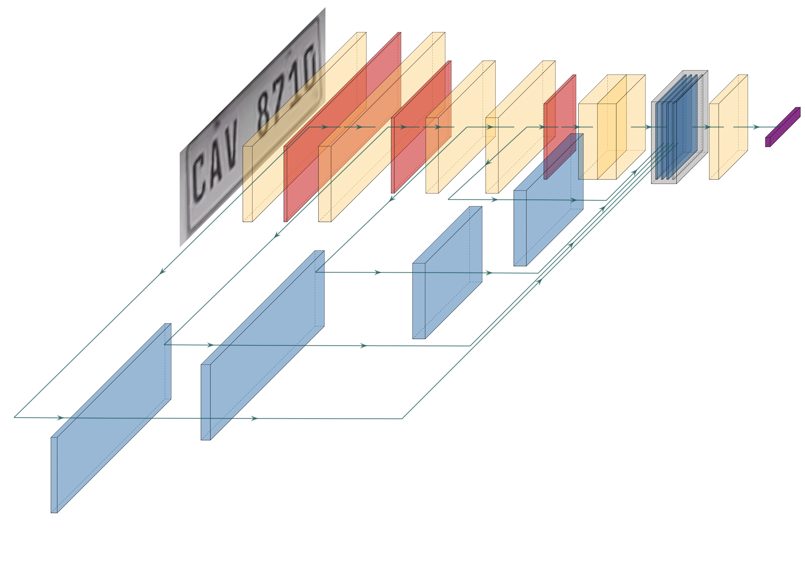

# LPRnet-keras
A keras implementation of the network proposed in https://arxiv.org/abs/1806.10447
LPRnet is a fully end to end licence plate recognition network with the following priorities:

1. Parameter efficiency
2. Speed

This repo contains all the code necessary to train LPRnet on a synthetic dataset
## Notes
1. Utilizes separable convolutional layers as opposed to the normal convolutional layers used in the paper.
2. Training data is generated at train time. 
3. Dataset generation adopted from https://github.com/bluesy7585/tensorflow_LPRnet
4. Dataset augmentation adopted from the proposed system in https://arxiv.org/abs/2108.06949, code available at https://github.com/roatienza/straug

## Training
To train LPRnet, run the following script to train with 10000 epochs.
```shell
python train.py 10000
```

## Demos
This script runs a quick demo of LPRnet on a video using MobileNetV2SSD-FPNLite as the licence plate detector.
```shell 
python demo/sync.py
```
## Dataset generation
A keras generator is used to generate synthetic images at train time. Fonts are located in ```\fonts```. 

## Model architecture
The model architecture is implemented with the following modifications:

1. Depthwise separable convolutional layers are used as a drop in replacement for the regular convolutional layers.
2. Global context is used concatenating each small basic block as suggested in the paper.

Architecture

## Looking forward 
1. Improve synthetic data generation. 
2. Make implementation compatible with google's coral TPU compiler.